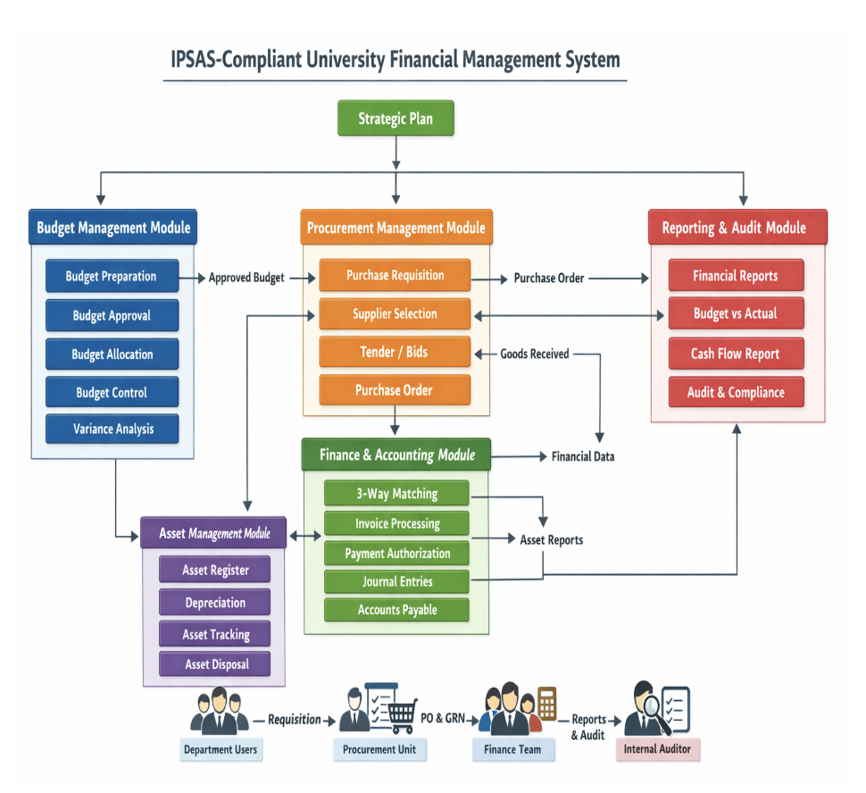

IPSAS-Compliant University Financial Management System

 
1. Database Schema (Key Tables & Fields)
A. Budget Module
Table
Key Fields
Description
budget
Budget_ID, Fiscal_Year, Department_ID, Programme, Budget_Category, Account_Code, Approved_Amount, Committed_Amount, Actual_Amount, Balance
Master budget records
budget_allocation
Allocation_ID, Budget_ID, Department_ID, Allocated_Amount, Allocation_Date
Funds allocated to departments
budget_variance
Variance_ID, Budget_ID, Department_ID, Actual_Amount, Budgeted_Amount, Variance
Budget monitoring
B. Procurement Module
Table
Key Fields
Description
purchase_requisition
Requisition_ID, Department_ID, Item_Description, Quantity, Estimated_Cost, Budget_Line, Status
Initiation of purchase request
procurement_plan
Plan_ID, Department_ID, Item, Estimated_Cost, Procurement_Method, Fiscal_Year
Planned procurement items
supplier
Supplier_ID, Name, Contact, Bank_Details, Status
Supplier database
purchase_order
PO_ID, Requisition_ID, Supplier_ID, PO_Date, Amount, Status
Issued purchase orders
goods_received
GRN_ID, PO_ID, Received_Date, Quantity, Status
Goods/services delivered
C. Finance / Accounting Module
Table
Key Fields
Description
journal_entry
Entry_ID, Date, Account_Code, Debit, Credit, Description, Reference
IPSAS-compliant journal entries
accounts_payable
AP_ID, Supplier_ID, Invoice_No, Amount, Due_Date, Status
Outstanding supplier invoices
accounts_receivable
AR_ID, Student_ID / Payer_ID, Invoice_No, Amount, Status
University receivables
bank_transaction
Transaction_ID, Account_Code, Amount, Type (Debit/Credit), Date, Reference
Bank transactions
D. Revenue Management
Table
Key Fields
Description
payment
Payment_ID, Student_ID, Fee_Type, Amount, Payment_Method, Receipt_No, Payment_Date, Status
Captures all revenue collections
student_account
Student_ID, Outstanding_Balance, Last_Payment_Date
Student financial summary
E. Asset Management
Table
Key Fields
Description
asset
Asset_ID, Name, Category, Purchase_Date, Cost, Depreciation_Method, Useful_Life, Current_Value, Status
Asset records
asset_disposal
Disposal_ID, Asset_ID, Disposal_Date, Disposal_Value, Approval
Disposed assets
F. Reporting / Audit
Table
Key Fields
Description
financial_report
Report_ID, Report_Type, Fiscal_Year, Generated_Date, Status
Generated reports
audit_log
Log_ID, User_ID, Action, Module, Timestamp
Tracks all user actions
 
2. System Workflow Diagram (Simplified)
Strategic Plan → Budget Module → Budget Approval → Purchase Requisition → Procurement → Goods Received → Invoice → Payment → Journal Entry → Financial Reporting → Audit

This workflow ensures IPSAS accrual accounting compliance, budget control, and audit trail transparency.

 
3. User Roles & Permissions
Role
Permissions
Department Officer
Create requisitions, view budget allocation
Department Head
Approve requisitions, view department budget
Procurement Officer
Create procurement plan, manage suppliers, issue POs
Finance Officer
Verify invoices, process payments, record journal entries
CFO / Finance Manager
Approve payments, monitor budget, generate reports
Internal Auditor
View all transactions, run audit reports
System Admin
Manage users, roles, system configuration
 
4. Dashboard Layout
Finance Officer Dashboard: - Pending approvals - Budget vs Actual summary - Accounts Payable & Receivable - Bank account balances - Alerts for overdue payments

Procurement Officer Dashboard: - Open Purchase Requisitions - Active Purchase Orders - Supplier Status - Procurement Plan overview

Department Head Dashboard: - Departmental Budget balance - Pending requisitions - Expenditure summary

CFO Dashboard: - Full Budget Overview - Financial Statements (IPSAS-compliant) - Cashflow summary - Audit alerts & compliance indicators

 
5. Complete System Workflow
Strategic Plan → Budget Approved → Purchase Requisition → Budget Check → Procurement Process → Purchase Order → Goods Received → Invoice Received → 3-Way Matching → Payment Authorization → Payment Processed → Journal Entry → Financial Reporting → Audit & Monitoring

 
6. Internal Controls
• Segregation of duties
• Role-based access
• Approval workflows
• Audit logs
• Document attachments
 

 
8. Diagram
 

1. Budgeting Workflow (Planning Stage) 📊
This stage determines how resources will be allocated before spending begins.
Step 1: Strategic Planning
• Define institutional objectives.
• Align with national development plans or institutional strategy.
Step 2: Departmental Budget Preparation
Each department prepares:
• Operational budget
• Capital budget
• Activity-based estimates
Documents prepared:
• Budget request forms
• Programme/activity plans
• Cost estimates
Step 3: Budget Review
Finance/Budget Committee:
• Reviews departmental submissions
• Ensures alignment with available resources
• Adjusts allocations
Step 4: Budget Consolidation
Finance unit compiles:
• Institutional master budget
• Revenue projections
• Expenditure estimates
Step 5: Budget Approval
Approval by:
• Management Board
• Governing Council
• Ministry or oversight authority
Step 6: Budget Upload into Financial System
Budget is captured in the financial management system for:
• Budget control
• Commitment monitoring
 
2. Procurement Workflow (Acquisition Stage) 🛒
This stage ensures goods/services are acquired legally and efficiently.
Step 1: Needs Identification
Department identifies requirement:
• Goods
• Services
• Works
Document:
• Purchase Requisition
Step 2: Budget Verification
Finance unit confirms:
• Budget availability
• Correct budget line
Outcome:
• Budget commitment created.
Step 3: Procurement Planning
Procurement unit:
• Confirms item is in procurement plan.
• Determines procurement method.
Methods include:
• Request for Quotations
• Competitive Tender
• Single Source Procurement
Step 4: Supplier Selection
Activities:
• Invite quotations/tenders
• Evaluation of bids
• Selection of vendor
Documents:
• Evaluation report
• Tender committee approval
Step 5: Purchase Order / Contract Award
Procurement issues:
• Purchase Order (PO)
or
• Contract agreement
Step 6: Delivery of Goods/Services
Supplier delivers.
Verification by:
• Stores
• User department
Documents:
• Delivery note
• Goods Received Note (GRN)
 
3. Accounting / Finance Workflow (Recording & Payment Stage) 💰
IPSAS focuses heavily on accurate recording of transactions and accrual accounting.
Step 1: Invoice Submission
Supplier submits:
• Invoice
• Delivery note
• Purchase order reference
Step 2: Invoice Verification
Finance verifies:
• PO exists
• Goods received
• Correct price
Matching process:
• 3-Way Matching
o Purchase Order
o Goods Received Note
o Invoice
Step 3: Payment Authorization
Approvals required:
• Head of Department
• Finance Officer
• Chief Finance Officer
Step 4: Payment Processing
Finance processes payment via:
• Bank transfer
• Cheque
• Electronic payment
Entries recorded in:
• Accounts payable
• General ledger
Step 5: Accounting Entries (IPSAS Accrual Example)
When goods are received:
Dr Expense / Asset
Cr Accounts Payable
When payment is made:
Dr Accounts Payable
Cr Bank
Step 6: Financial Reporting
Reports generated:
• Statement of Financial Position
• Statement of Financial Performance
• Cash Flow Statement
• Budget vs Actual Report
 
4. Monitoring and Control Workflow 🔍
IPSAS requires strong internal controls and accountability.
Internal Controls
• Segregation of duties
• Budget control
• Approval hierarchy
Monitoring Activities
• Monthly budget review
• Financial performance reports
• Variance analysis
Auditing
• Internal audit
• External audit
5. Complete IPSAS Financial Workflow (Simplified Flow)
Strategic Plan
     ↓
Budget Preparation
     ↓
Budget Approval
     ↓
Budget Allocation
     ↓
Purchase Requisition
     ↓
Budget Check
     ↓
Procurement Process
     ↓
Purchase Order Issued
     ↓
Goods/Services Delivered
     ↓
Invoice Received
     ↓
3-Way Matching
     ↓
Payment Approval
     ↓
Payment Processing
     ↓
Accounting Entry (IPSAS)
     ↓
Financial Reporting
     ↓
Audit & Monitoring
 

IPSAS-Compliant Financial Management System Architecture
The system should consist of six integrated modules:
1. Budget Management Module
2. Procurement Management Module
3. Finance & Accounting Module
4. Revenue Management Module
5. Asset Management Module
6. Reporting & Audit Module
Each module interacts with the others.
Strategic Plan
     ↓
Budget Module
     ↓
Procurement Module
     ↓
Finance & Accounting Module
     ↓
Asset Module
     ↓
Reporting & Audit Module
 
1. Budget Management Module 📊
Purpose
To plan, approve, control and monitor institutional finances.
Key Functions
• Budget preparation
• Budget approval workflow
• Budget allocation
• Budget control
• Budget variance analysis
Key Database Fields
Budget Table
Field
Description
Budget_ID
Unique budget number
Fiscal_Year
Budget year
Department_ID
Department responsible
Budget_Category
Recurrent / Capital
Programme
Activity/program
Account_Code
Chart of accounts
Approved_Amount
Budget approved
Committed_Amount
Amount committed
Actual_Amount
Amount spent
Balance
Remaining funds
Workflow
Department prepares budget
     ↓
Budget Committee review
     ↓
Finance Consolidation
     ↓
Management Approval
     ↓
Budget uploaded into system
     ↓
Budget available for spending
Control Mechanism
System must reject any purchase requisition if budget balance is insufficient.
 
2. Procurement Management Module 🛒
Purpose
To manage acquisition of goods, services, and works.
Key Functions
• Purchase requisition
• Procurement planning
• Supplier management
• Tender evaluation
• Purchase order generation
Key Tables
Purchase Requisition Table
Field
Description
Requisition_ID
Unique request number
Department
Requesting department
Item_Description
Item required
Quantity
Requested quantity
Estimated_Cost
Estimated price
Budget_Line
Budget code
Approval_Status
Pending/Approved
 
Procurement Workflow
User Department
     ↓
Create Purchase Requisition
     ↓
Department Head Approval
     ↓
Finance Budget Check
     ↓
Procurement Unit Review
     ↓
Tender / Quotation Process
     ↓
Supplier Selected
     ↓
Purchase Order Issued
 
3. Finance & Accounting Module 💰
Purpose
To record financial transactions using IPSAS accrual accounting.
Key Functions
• Accounts payable
• Accounts receivable
• General ledger
• Bank reconciliation
• Journal entries
Chart of Accounts Structure
Example:
1000 Assets
  1100 Cash
  1200 Receivables
  1300 Inventory
  1400 Property Plant Equipment

2000 Liabilities
  2100 Accounts Payable
  2200 Accrued Expenses

3000 Net Assets

4000 Revenue

5000 Expenses
 
IPSAS Accounting Workflow
Purchase Order Issued
     ↓
Goods Delivered
     ↓
Goods Received Note (GRN)
     ↓
Supplier Invoice Received
     ↓
3-Way Matching
     ↓
Invoice Approved
     ↓
Journal Entry Generated
     ↓
Payment Processed
 
Example IPSAS Journal Entries
When goods are received
Dr Expense / Asset
Cr Accounts Payable
When payment is made
Dr Accounts Payable
Cr Bank
 
4. Revenue Management Module 💳
Very important for universities.
Revenue Sources
• School fees
• Graduation fees
• Transcript fees
• Conference payments
• Hostel fees
• Research grants
Key Functions
• Student billing
• Payment integration (mobile money, bank)
• Receipt generation
• Revenue recognition (IPSAS)
Revenue Table
Field
Description
Payment_ID
Unique transaction
Student_ID
Student number
Fee_Type
Tuition, transcript
Amount
Amount paid
Payment_Method
Bank/MoMo
Receipt_No
Receipt number
Payment_Date
Date
 
5. Asset Management Module 🏢
IPSAS requires proper asset recognition and depreciation.
Key Functions
• Asset registration
• Asset tracking
• Depreciation calculation
• Asset disposal
• Asset revaluation
Asset Table
Field
Description
Asset_ID
Unique ID
Asset_Name
Asset description
Asset_Category
Furniture, Equipment
Purchase_Date
Date acquired
Cost
Acquisition cost
Depreciation_Method
Straight line
Useful_Life
Years
Current_Value
Net book value
Asset Workflow
Asset Purchased
     ↓
Asset Registered
     ↓
Asset Tag Generated
     ↓
Annual Depreciation
     ↓
Asset Monitoring
     ↓
Asset Disposal
 
6. Reporting & Audit Module 📑
Purpose
Generate IPSAS-compliant financial statements.
Key Reports
1. Statement of Financial Position
Assets
Liabilities
Net Assets
2. Statement of Financial Performance
Revenue
Expenses
Surplus/Deficit
3. Cash Flow Statement
Operating Activities
Investing Activities
Financing Activities
4. Budget vs Actual Report
| Department | Budget | Actual | Variance |
 
7. Internal Control Features 🔐
To prevent fraud and errors.
Segregation of Duties
Role
Responsibility
Department Officer
Initiates request
Procurement Officer
Handles procurement
Finance Officer
Payment processing
CFO
Payment approval
Internal Auditor
Monitoring
 
System Security
• Role-based access
• Audit logs
• Approval workflow
• Document attachments
 
8. Example System Workflow (Complete Cycle)
Budget Approved
     ↓
Purchase Requisition
     ↓
Budget Check
     ↓
Procurement Process
     ↓
Purchase Order
     ↓
Goods Received
     ↓
Invoice Submitted
     ↓
3-Way Matching
     ↓
Payment Authorization
     ↓
Payment Processing
     ↓
Journal Entry
     ↓
Financial Reporting
     ↓
Audit Review